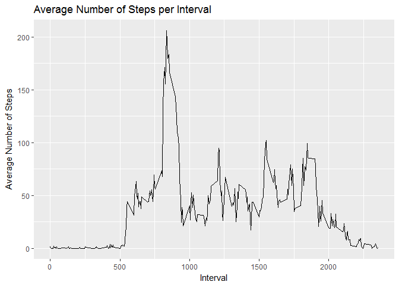

Loading and preprocessing the data
----------------------------------

Loading the Data

    library(ggplot2)

    ## Warning: package 'ggplot2' was built under R version 3.4.3

    library(plyr)

    ## Warning: package 'plyr' was built under R version 3.4.3

    activity <- read.csv("activity.csv")

Processing the Data

    activity$day <- weekdays(as.Date(activity$date))
    activity$DateTime<- as.POSIXct(activity$date, format="%Y-%m-%d")

Pulling data without nas

    clean <- activity[!is.na(activity$steps),]

What is mean total number of steps taken per day?
-------------------------------------------------

Calculate the total number of steps taken per day

Summarizing total steps per date

    sumTable <- aggregate(activity$steps ~ activity$date, FUN=sum, )
    colnames(sumTable)<- c("Date", "Steps")

Make a histogram of the total number of steps taken each day

Creating the historgram of total steps per day

    hist(sumTable$Steps, breaks=5, xlab="Steps", main = "Total Steps per Day")

Calculate and report the mean and median of the total number of steps
taken per day

Mean and Median of Steps

    as.integer(mean(sumTable$Steps))

    ## [1] 10766

    as.integer(median(sumTable$Steps))

    ## [1] 10765

What is the average daily activity pattern?
-------------------------------------------

Make a time series plot (i.e. type = "l") of the 5-minute interval
(x-axis) and the average number of steps taken, averaged across all days
(y-axis)

    library(plyr)
    library(ggplot2)
    clean <- activity[!is.na(activity$steps),]
    intervalTable <- ddply(clean, .(interval), summarize, Avg = mean(steps))
    p <- ggplot(intervalTable, aes(x=interval, y=Avg), xlab = "Interval", ylab="Average Number of Steps")
    p + geom_line()+xlab("Interval")+ylab("Average Number of Steps")+ggtitle("Average Number of Steps per Interval")

Which 5-minute interval, on average across all the days in the dataset,
contains the maximum number of steps?

    maxSteps <- max(intervalTable$Avg)
    intervalTable[intervalTable$Avg==maxSteps,1]

    ## [1] 835

The maximum number of steps for a 5-minute interval was 206 steps.

The 5-minute interval which had the maximum number of steps was the 835
interval.

Imputing missing values
-----------------------

Calculate and report the total number of missing values in the dataset
(i.e. the total number of rows with NAs)

    nrow(activity[is.na(activity$steps),])

    ## [1] 2304

The total number of rows with steps = 'NA' is 2304.

Devise a strategy for filling in all of the missing values in the
dataset. The strategy does not need to be sophisticated. For example,
you could use the mean/median for that day, or the mean for that
5-minute interval, etc.

My strategy for filling in NAs will be to substitute the missing steps
with the average 5-minute interval based on the day of the week.

    avgTable <- ddply(clean, .(interval, day), summarize, Avg = mean(steps))
    nadata<- activity[is.na(activity$steps),]
    newdata<-merge(nadata, avgTable, by=c("interval", "day"))

Create a new dataset that is equal to the original dataset but with the
missing data filled in.

    newdata2<- newdata[,c(6,4,1,2,5)]
    colnames(newdata2)<- c("steps", "date", "interval", "day", "DateTime")
    mergeData <- rbind(clean, newdata2)

Make a histogram of the total number of steps taken each day and
Calculate and report the mean and median total number of steps taken per
day. Do these values differ from the estimates from the first part of
the assignment? What is the impact of imputing missing data on the
estimates of the total daily number of steps?

    sumTable2 <- aggregate(mergeData$steps ~ mergeData$date, FUN=sum, )
    colnames(sumTable2)<- c("Date", "Steps")
    as.integer(mean(sumTable2$Steps))

    ## [1] 10821

    as.integer(median(sumTable2$Steps))

    ## [1] 11015

    hist(sumTable2$Steps, breaks=5, xlab="Steps", main = "Total Steps per Day with NAs Fixed", col="Black")
    hist(sumTable$Steps, breaks=5, xlab="Steps", main = "Total Steps per Day with NAs Fixed", col="Grey", add=T)
    legend("topright", c("Imputed Data", "Non-NA Data"), fill=c("black", "grey") )

The new mean of the imputed data is 10821 steps compared to the old mean
of 10766 steps. That creates a difference of 55 steps on average per
day.

The new median of the imputed data is 11015 steps compared to the old
median of 10765 steps. That creates a difference of 250 steps for the
median.

However, the overall shape of the distribution has not changed.

Are there differences in activity patterns between weekdays and weekends?
-------------------------------------------------------------------------

Create a new factor variable in the dataset with two levels - "weekday"
and "weekend" indicating whether a given date is a weekday or weekend
day.

    mergeData$DayCategory <- ifelse(mergeData$day %in% c("Saturday", "Sunday"), "Weekend", "Weekday")

Make a panel plot containing a time series plot (i.e. type = "l") of the
5-minute interval (x-axis) and the average number of steps taken,
averaged across all weekday days or weekend days (y-axis).

    library(lattice) 
    intervalTable2 <- ddply(mergeData, .(interval, DayCategory), summarize, Avg = mean(steps))
    xyplot(Avg~interval|DayCategory, data=intervalTable2, type="l",  layout = c(1,2),
           main="Average Steps per Interval Based on Type of Day", 
           ylab="Average Number of Steps", xlab="Interval")

Yes, the step activity trends are different based on whether the day
occurs on a weekend or not. This may be due to people having an
increased opportunity for activity beyond normal work hours for those
who work during the week.
